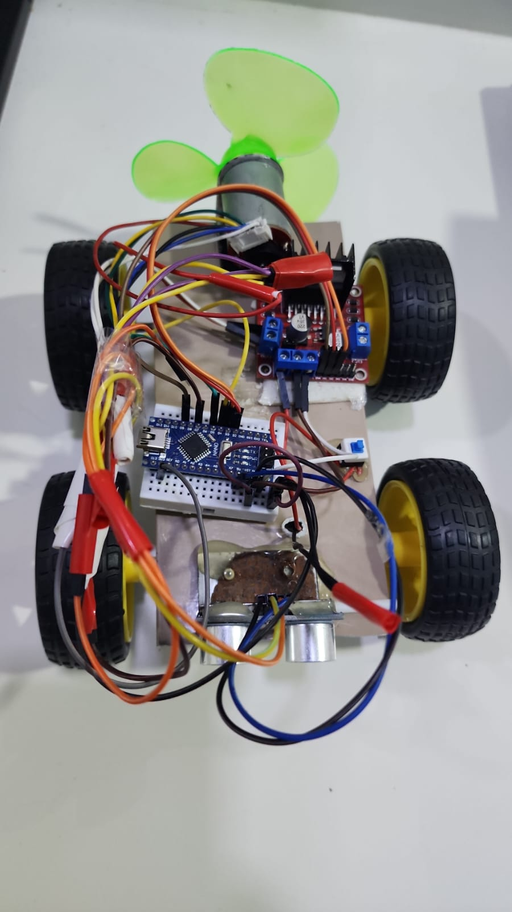

# 🌬️ Automated Air-Propelled Vehicle (Fluid & Electrical Drive System)

## 📌 Project Overview
This repository contains the documentation, source code, CAD models, and experimental media for a custom mechatronics freelance project. The project demonstrates the evolution of an Air-Propelled Vehicle from a purely aerodynamic mechanical prototype to an autonomous, microcontroller-driven vehicle capable of dynamic obstacle avoidance.

## 📂 Repository Structure
This project is modularly organized to separate code, CAD designs, documentation, and experimental results:

* **[Code/](Code/)**: Contains the Arduino C++ source code for the vehicle's automated control logic and a detailed breakdown of the state machine.
* **[Experiments/](Experiments/)**: Contains video demonstrations of the vehicle in both development phases (Mechanical vs. Automated) along with the experimental testing report.
* **[Report/](Report/)**: Contains the comprehensive Final Engineering Report detailing the mathematical modeling, fluid dynamics, and sustainability analysis.
* **[Solidworks/](Solidworks/)**: Contains all 3D CAD parts, assemblies, and 2D ANSI standard engineering drawings.

## 🛠️ Tools & Technologies Used
* **Programming:** C++ (Arduino IDE)
* **CAD & Simulation:** SolidWorks, TinkerCAD
* **Hardware:** Arduino Nano, HC-SR04 Ultrasonic Sensor, L298N Motor Driver, 12V DC Motor
* **Domains:** Mechatronics, Aerodynamics, Control Systems, Embedded C